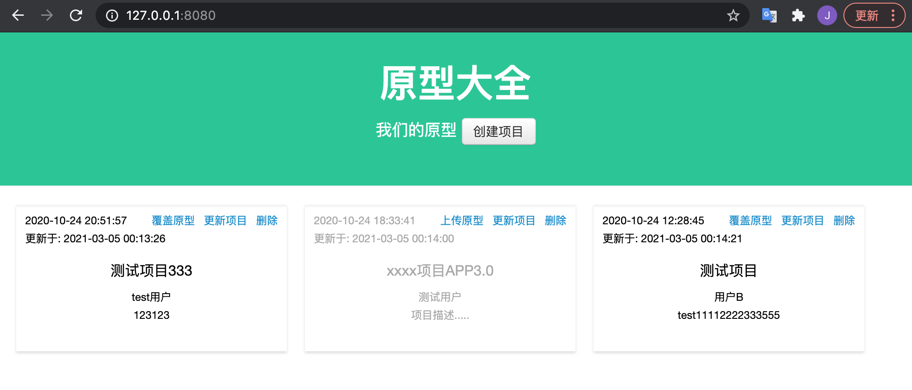

# prototype-Show: 快速简单地上传，以及预览HTML的web程序



## 背景
产品经理利用Axure设计原型, 需要快速、即时直接分享给前后端开发、测试等人员, 一般可能会使用蓝湖或者摹客，但是存在几个问题：
- 上传时间比较久（因为经常坑你会包含比较多的图片，导出的静态文件几十上百兆，公司网络也不太稳定）
- 蓝湖或者摹客免费版都有人数限制，一般是10人左右，但是我们的团队不止10人，10人根本满足不了我们的需求。而我们也不想使用付费版。

于是乎我们就想把原型(导出的静态文件)部署到自己的服务器。如果直接部署到nginx固然可以，但是产品并不一定懂技术，而且每次上传到服务器也麻烦，并且项目也比较多，每次去操作也比较麻烦，也不方便记住路径等等。

所以就有了这个原型大全。该工具其实也是从一个开源找来做了很多的优化调整而来。

并且该工具懂点后端和前端的同学都可以根据需要做一些调整。

## 打包与安装
- 编译打包
```shell
mvn clean package -Dmaven.test.skip=true
```

- Docker镜像并部署
```shell
# 本机操作
# 在根目录下直接使用Docker命令打包
docker build -t mafgwo/prototype-show:v1.0 . 
# 本地压缩docker包并传输到服务器上 如果公司有私有仓库建议直接上传到私有仓库 然后在服务器上直接部署即可
docker save -o prototype-show1.0.tar mafgwo/prototype-show:v1.0
# 上传到服务器上
scp prototype-show1.0.tar root@192.168.90.221:/root/

# 服务器上操作
docker load -i prototype-show1.0.tar
# 工作目录
mkdir /opt/prototype-show
# docker启动命令
docker run -d --restart always --name prototype-show -p 8080:8080 -v /opt/prototype-show:/data mafgwo/prototype-show:v1.0
```

- Jar直接启动
```shell
java -jar prototype-show.jar
```

访问: http://127.0.0.1:8080

注: 默认数据存储目录: ${HOME}/.prototype-show, 项目元信息: project.json, 静态资源: project/
